# 🛒 Supermart Grocery Sales – Retail Analytics & Machine Learning

<p align="center">


</p>

---

# 📌 Project Overview

This project presents an **end-to-end Retail Sales Analytics solution** built using **Python, Machine Learning, and an Interactive Business Intelligence Dashboard**.

Using a fictional grocery supermarket dataset from Tamil Nadu, India, the project demonstrates the complete analytics lifecycle:

- Data Cleaning
- Exploratory Data Analysis (EDA)
- Statistical Analysis
- Business Intelligence
- Machine Learning
- Time Series Forecasting
- Interactive Dashboard Development

The objective is to transform raw retail transactions into actionable business insights that assist decision-makers in improving profitability, inventory planning, customer targeting, and sales forecasting.

---

# 🚀 Live Dashboard Preview


---

# 📂 Repository Structure

```
Supermarket-Sales-Data-Analysis
│
├── dashboard/
│   ├── src/
│   ├── public/
│   ├── images/
│   └── package.json
│
├── dataset/
│   └── Supermart Grocery Sales – Retail Analytics Dataset.csv
│
├── notebook/
│   └── Supermart_Grocery_Sales_Retail_Analysis.ipynb
│
└── README.md
```

---

# 🎯 Business Problem

Retail businesses generate thousands of transactions every day.

Without proper analysis it becomes difficult to:

- Identify profitable products
- Understand customer purchasing behavior
- Measure discount effectiveness
- Detect sales anomalies
- Forecast future demand
- Improve business decisions

This project solves these problems through data analytics and predictive modeling.

---

# ⚙️ Technology Stack

| Category | Tools |
|-----------|------|
| Programming | Python |
| Data Analysis | Pandas, NumPy |
| Visualization | Matplotlib, Seaborn |
| Machine Learning | Scikit-Learn |
| Dashboard | Next.js, React, TypeScript |
| Version Control | Git & GitHub |
| Notebook | Jupyter Notebook |

---

# 📊 Dataset

**Source**

Supermart Grocery Sales Dataset

Contains approximately **10,000 retail transactions** across Tamil Nadu.

### Features

- Order ID
- Customer Name
- Category
- Sub Category
- City
- Region
- State
- Sales
- Profit
- Discount
- Quantity
- Order Date

---

# 🔄 Data Analytics Workflow

```
Raw Dataset

        ↓

Data Cleaning

        ↓

EDA

        ↓

Business Insights

        ↓

Statistical Analysis

        ↓

Machine Learning

        ↓

Forecasting

        ↓

Interactive Dashboard
```

---

# 🧹 Data Preprocessing

The dataset was cleaned and prepared before analysis.

Performed:

- Missing value validation
- Duplicate detection
- Feature engineering
- Label Encoding
- Scaling
- Outlier Detection

### Dashboard

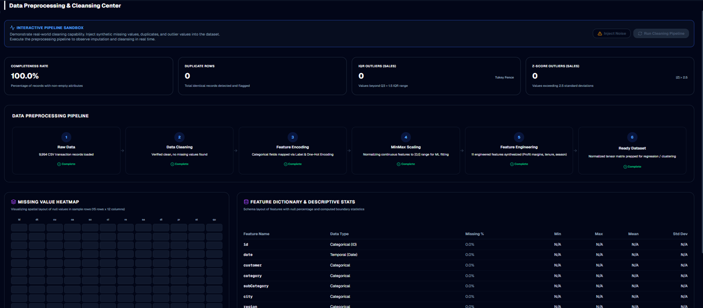

---

# 📈 Exploratory Data Analysis

The EDA dashboard provides insights into:

- Sales Trends
- Profit Trends
- Category Performance
- Customer Distribution
- Regional Performance

### Dashboard

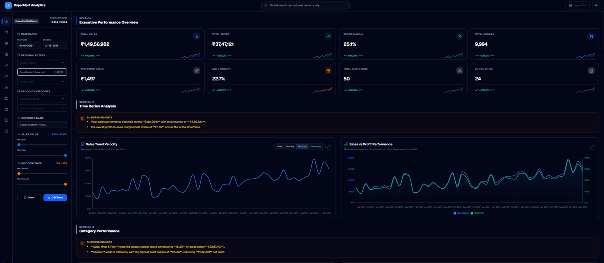

---

# 💼 Executive Business Intelligence

The BI dashboard summarizes the most important KPIs including:

- Revenue
- Profit
- Average Order Value
- Active Customers
- Discount Analysis
- Category Performance

### Dashboard

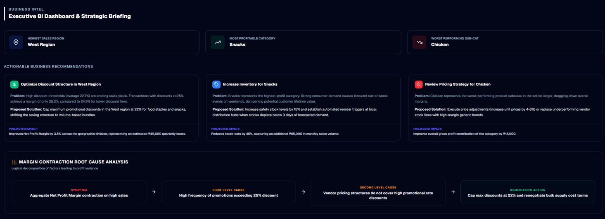

---

# 🚨 Anomaly Detection

Isolation Forest was implemented to identify unusual transactions.

The dashboard highlights:

- High-risk transactions
- Outlier Scores
- Profit anomalies
- Root Cause Analysis

### Dashboard


---

# 📊 Statistical Analysis

Performed:

- Pearson Correlation
- Spearman Correlation
- Distribution Analysis
- Boxplots
- Hypothesis Testing
- Descriptive Statistics

### Dashboard

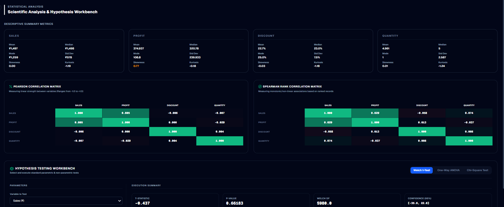

---

# 🤖 Machine Learning

Built predictive models for sales forecasting.

Models explored:

- Linear Regression
- Random Forest
- XGBoost

Evaluation Metrics:

- MAE
- RMSE
- R² Score

### Dashboard

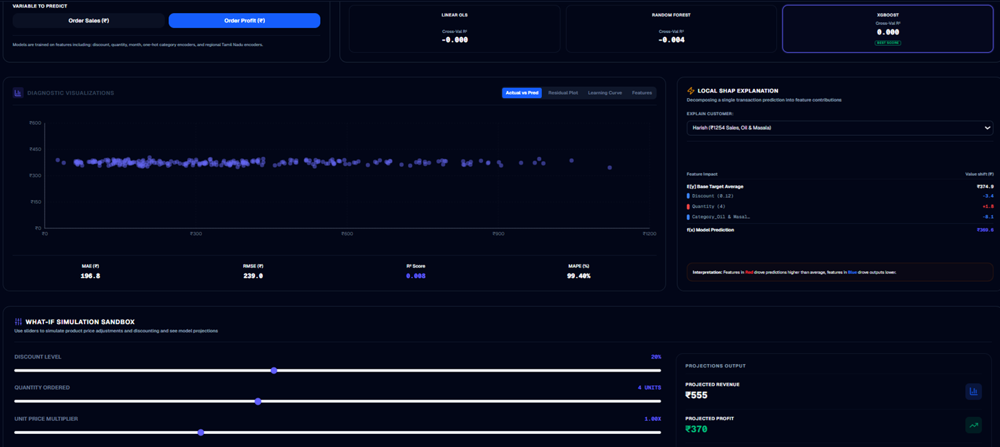

---

# 📅 Time Series Forecasting

Forecasted future sales using historical sales trends.

Features include:

- Trend Analysis
- Seasonal Decomposition
- Forecast Confidence
- Future Revenue Projection

### Dashboard

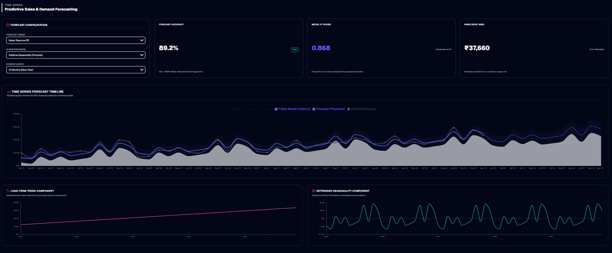

---

# 📷 Executive Dashboard Gallery

## Executive Dashboard


---

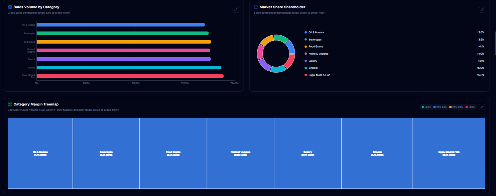

---

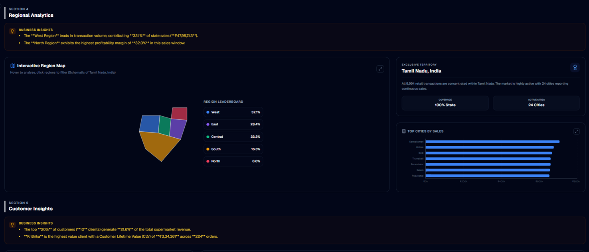

---

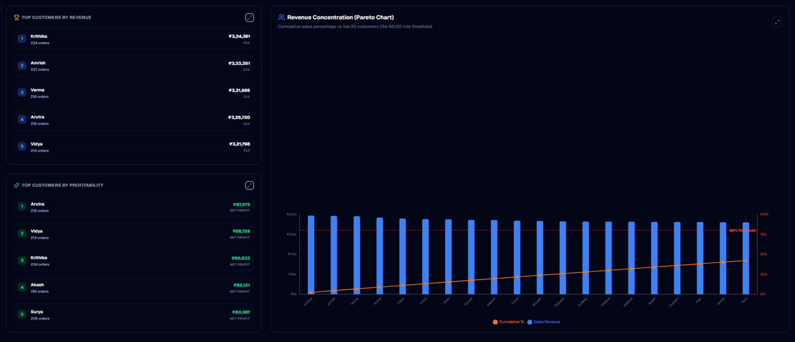

---

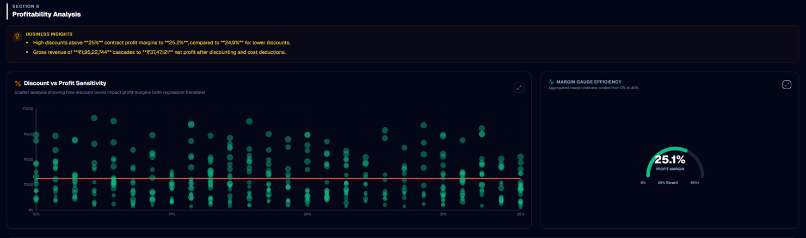

---

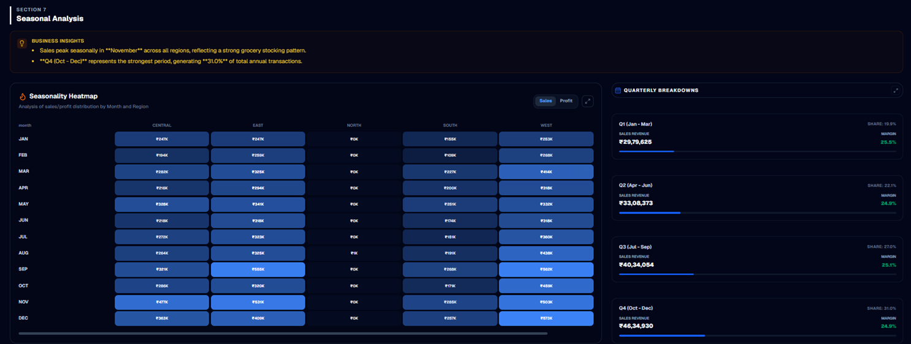

---

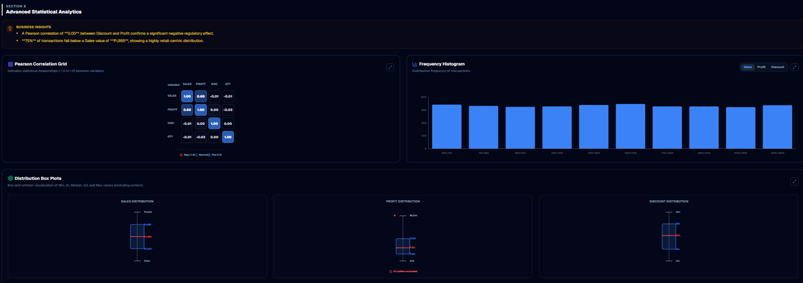

---

# 📌 Key Business Insights

✔ Egg, Meat & Fish generated the highest sales contribution.

✔ West Region produced the highest overall revenue.

✔ Discounts above 25% significantly reduced profit margins.

✔ Seasonal demand peaks during October–December.

✔ A small percentage of customers contribute a significant share of revenue (Pareto Principle).

✔ Machine Learning models provide reliable sales forecasting for future planning.

---

# 📈 Project Highlights

- Complete End-to-End Data Science Project
- Interactive Business Intelligence Dashboard
- Statistical Analysis
- Customer Analytics
- Time Series Forecasting
- Machine Learning
- Professional Dashboard UI
- Clean Repository Structure

---

# 🚀 Future Improvements

- Deep Learning Models
- Customer Churn Prediction
- Product Recommendation System
- Real-time Dashboard
- Cloud Deployment
- Power BI Integration
- Streamlit Version

---

# 👨‍💻 Author

**Aditya Sharma**


GitHub:
https://github.com/aditya-sharma-hub

---

⭐ If you found this project useful, consider giving the repository a star!
